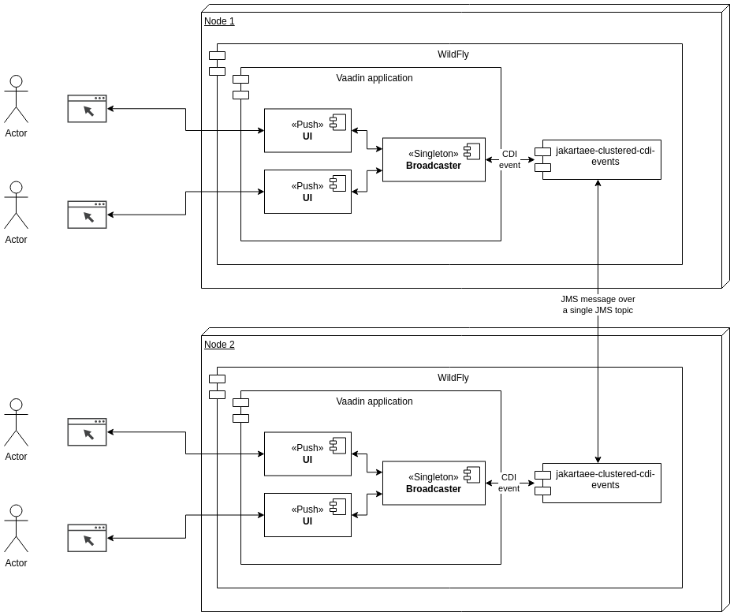

# jakartaee-clustered-cdi-events testing application

This application is created for testing the
[`jakartaee-clustered-cdi-events`](https://github.com/mrts/jakartaee-clustered-cdi-events)
EJB module. It demonstrates with a Vaadin application how CDI events can be
transparent broadcasted within a WildFly (or any other Jakarta EE 8) cluster.

## Components

- `Broadcaster`: Manages event listeners and broadcasts messages to all registered consumers according to the Vaadin Broadcaster pattern.
- `Message`: A simple message class marked with `@Clustered` to enable cluster-wide event distribution.
- `MainView`: A Vaadin view that allows users to send messages and view received broadcasts from local and other nodes.

Here's the component diagram:




## Building and running

You need Maven and Java 11 JDK to build and run the application.

First, build and install `jakartaee-clustered-cdi-events` locally as it is not
published in Maven Central yet:

    cd jakartaee-clustered-cdi-events
    mvn clean install

Then build the test application WAR with

    mvn vaadin:prepare-frontend
    mvn package

and deploy the resulting WAR to the application server.

See other configuration and running instructions in the
`jakartaee-clustered-cdi-events` project
[README](https://github.com/mrts/jakartaee-clustered-cdi-events#configuration).

**WORK IN PROGRESS**

Dockerfile and docker-compose.yml

## Usage

1. Open <http://localhost:8080/> in a web browser.
2. Type a message and click "Broadcast" to send a CDI event.
3. The application displays messages received from the CDI event system.

## Cross-bridging JMS on two WildFly servers

**WORK IN PROGRESS**

We are using a JMS cross-bridge for simulating JMS clustering between two
separate WildFly server instances. By cross-bridging JMS on these servers, the
messages are replicated from a topic on one server to the same topic on the
other, like in a JMS cluster.

The process involves:

1. Setting up a user on both server instances.
2. Configuring the `standalone-full.xml` file of instance A to include a JMS
   bridge with the bridge’s source destination connecting to Instance B.
3. Similarly, configuring the `standalone-full.xml` on Instance B to include
   the bridge with the bridge’s source destination connecting to Instance A.

The target destination of the bridge is the `CLUSTER_CDI_EVENTS` topic used in
`jakartaee-clustered-cdi-events`.

Here are the commands for adding the topic, user and bridge
(TODO: replace `instance-b`):

```sh
add-user.sh -a -u jmsuser -p jmspass -g guest

jboss-cli.sh --connect --command='jms-topic add --topic-address=CLUSTER_CDI_EVENTS --entries=java:/jms/topic/CLUSTER_CDI_EVENTS'

jboss-cli.sh --connect --commands='/subsystem=logging/logger=org.apache.activemq.artemis.jms.bridge:add(level=WARN),/subsystem=logging/logger=org.apache.activemq.artemis.jms.bridge:write-attribute(name=filter-spec, value="not(match('AMQ342009.*'))")'
jboss-cli.sh --connect --commands='/subsystem=logging/logger=org.apache.activemq.artemis.core.server:add(level=WARN),/subsystem=logging/logger=org.apache.activemq.artemis.core.server:write-attribute(name=filter-spec, value="not(match('AMQ222059.*'))")'

jboss-cli.sh --connect --command='/subsystem=messaging-activemq/jms-bridge=wildfly-bridge:add(max-batch-time=100,max-batch-size=10,max-retries=30,failure-retry-interval=60000,quality-of-service=AT_MOST_ONCE,target-destination=java:/jms/topic/CLUSTER_CDI_EVENTS,target-connection-factory=ConnectionFactory,source-user=jmsuser,source-password=jmspass,source-destination=java:/jms/topic/CLUSTER_CDI_EVENTS,source-connection-factory=jms/RemoteConnectionFactory,source-context={java.naming.factory.initial=org.jboss.naming.remote.client.InitialContextFactory,java.naming.provider.url=http-remoting://instance-b:${jboss.http.port:8080},java.naming.security.principal=jmsuser,java.naming.security.credentials=jmspass})'
```

## License

This project is licensed under the Apache License - see the [LICENSE](LICENSE) file for details.

Here's how to apply the license with `addlicense`:

```sh
go install github.com/google/addlicense@latest
~/go/bin/addlicense -c 'Your Name' -s=only -l=apache src/
```
